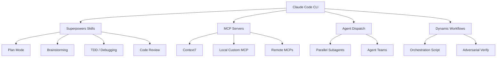

# Agentic Development with Claude Code

Agentic development is the practice of delegating multi-step engineering work to an AI agent that plans, executes, and validates tasks autonomously — rather than answering one prompt at a time. Instead of asking Claude "write this function" and manually applying the result, you give it a goal and let it explore the codebase, reason about the approach, write the code, review it, and prepare a commit. The developer's role shifts from typist to reviewer.

This repository documents the full setup behind that workflow: the tools, the configuration, the skills layer that governs agent behavior, and the patterns that make it reliable in practice. It is grounded in the architectural patterns described in [claude-code-best-practice](https://github.com/shanraisshan/claude-code-best-practice) — the separation of subagents, commands, skills, and workflows into distinct concerns, and the Research → Plan → Execute → Review → Ship loop as the foundation of every task.


```mermaid
graph TD
    A[Claude Code CLI] --> B[Superpowers Skills]
    A --> C[MCP Servers]
    A --> D[Agent Dispatch]
    A --> E[Dynamic Workflows]

    B --> B1[Plan Mode]
    B --> B2[Brainstorming]
    B --> B3[TDD / Debugging]
    B --> B4[Code Review]

    C --> C1[Context7]
    C --> C2[Local Custom MCP]
    C --> C3[Remote MCPs]

    D --> D1[Parallel Subagents]
    D --> D2[Agent Teams]

    E --> E1[Orchestration Script]
    E --> E2[Adversarial Verify]
```

---

## Quick Start

**Option A — guided setup (recommended):**

```bash
# 1. Install Claude Code
curl -fsSL https://claude.ai/install.sh | bash

# 2. Clone this repo and run the setup script
git clone https://github.com/LvcasX1/claude-code-workflow
cd claude-code-workflow
./setup.sh
```

The script installs plugins, walks you through MCP selection, collects API keys, optionally installs the grilling skills and a commit-rule hook, and verifies everything works. Re-running it skips steps that are already done.

**Option B — manual minimal setup:**

```bash
# 1. Install Claude Code
curl -fsSL https://claude.ai/install.sh | bash

# 2. Install Superpowers
claude plugin install superpowers@claude-plugins-official

# 3. Start in your project
cd /path/to/your/project
claude
> /init
```

That is enough to get the structured workflow running. `/init` generates `CLAUDE.md` and from that point every task follows the Research → Plan → Execute → Review → Ship loop enforced by Superpowers skills.

The documentation below covers the full picture: what Claude Code can do as of mid-2026, how it works internally, the planning and review discipline, and how to keep work continuous across sessions.

---

## Documentation

The guide is split into focused topics under [`docs/`](docs/).

### Understand the tool

| Doc | What it covers |
|-----|----------------|
| **[Claude Code Capabilities (June 2026)](docs/capabilities.md)** | The current feature landscape: dynamic workflows, `/goal` & `/loop`, scheduled/background agents, subagents vs teams vs workflows, ToolSearch, the model lineup. |
| **[Under the Hood — The Agent Loop](docs/under-the-hood.md)** | How Claude Code actually works: the message-array core, the 11-stage agent loop, the tool system, the source tree — drawing on [ccunpacked.dev](https://ccunpacked.dev/). |
| **[Skills vs Commands](docs/skills-vs-commands.md)** | What a skill, a command, a subagent, and an MCP each are — when to use which, and when not to. |

### Set it up

| Doc | What it covers |
|-----|----------------|
| **[Setup](docs/setup.md)** | Installing the CLI, Superpowers, the [mattpocock/skills](https://github.com/mattpocock/skills) grilling skills, Caveman, MCP servers, CCStatusLine, and hooks. |
| **[Creating Agents by Repo](docs/creating-agents.md)** | Purpose-built per-repo subagents: definition files, model/effort/isolation. |
| **[Creating Your Own MCP](docs/creating-mcp.md)** | Build a project-context MCP server in TypeScript end to end. |

### Run the workflow

| Doc | What it covers |
|-----|----------------|
| **[The Workflow](docs/workflow.md)** | The Research → Plan → Execute → Review → Ship loop, repo init, building knowledge, and agent dispatch. |
| **[Planning: Plan Mode vs Superpowers](docs/planning.md)** | The two planning approaches compared, when to use which, and where the `grill-me` grilling step fits. |
| **[Prompting](docs/prompting.md)** | The skill-first, MCP-second, task-last prompting pattern. |
| **[Code Review & Git Flow](docs/code-review-and-git.md)** | The review loop (`/code-review` with `--comment` / `--fix`, `/simplify`, two-axis review) and commit discipline (atomic, no co-authoring). |

### Make it durable

| Doc | What it covers |
|-----|----------------|
| **[Working Across Sessions](docs/session-continuity.md)** | Resume work like opencode: handoff docs, progress files, plans as resumable state, episodic memory. |
| **[Memory & Project Rules](docs/memory-and-rules.md)** | Encoding standing rules — e.g. "atomic commits, no co-author" — as `CLAUDE.md`, memory, or a hook. |

> New here? Read **[Capabilities](docs/capabilities.md)** → **[The Workflow](docs/workflow.md)** → **[Planning](docs/planning.md)**, then set up via **[Setup](docs/setup.md)**.

---

## Credits

| Tool | Description | Link |
|------|-------------|------|
| Claude Code | Anthropic's official CLI for Claude | [anthropics/claude-code](https://github.com/anthropics/claude-code) |
| Claude Code Best Practice | Foundational patterns: subagents, commands, skills, and the Research → Plan → Execute → Review → Ship loop | [shanraisshan/claude-code-best-practice](https://github.com/shanraisshan/claude-code-best-practice) |
| Superpowers | Skills plugin system for Claude Code | [obra/superpowers](https://github.com/obra/superpowers) |
| mattpocock/skills | Grilling, planning, implementation, and review skills (`grill-me`, `grill-with-docs`, `handoff`, `to-spec`, `implement`, `code-review`) | [mattpocock/skills](https://github.com/mattpocock/skills) |
| Context7 | Live library documentation for Claude | [upstash/context7](https://github.com/upstash/context7) |
| Model Context Protocol SDK | SDK for building MCP servers | [modelcontextprotocol/typescript-sdk](https://github.com/modelcontextprotocol/typescript-sdk) |
| CCStatusLine | Claude Code status line integration | [sirmalloc/ccstatusline](https://github.com/sirmalloc/ccstatusline) |
| Caveman | Token compression skill for Claude Code | [JuliusBrussee/caveman](https://github.com/JuliusBrussee/caveman) |
| Claude Code Unpacked | Interactive teardown of Claude Code's internals | [ccunpacked.dev](https://ccunpacked.dev/) |
