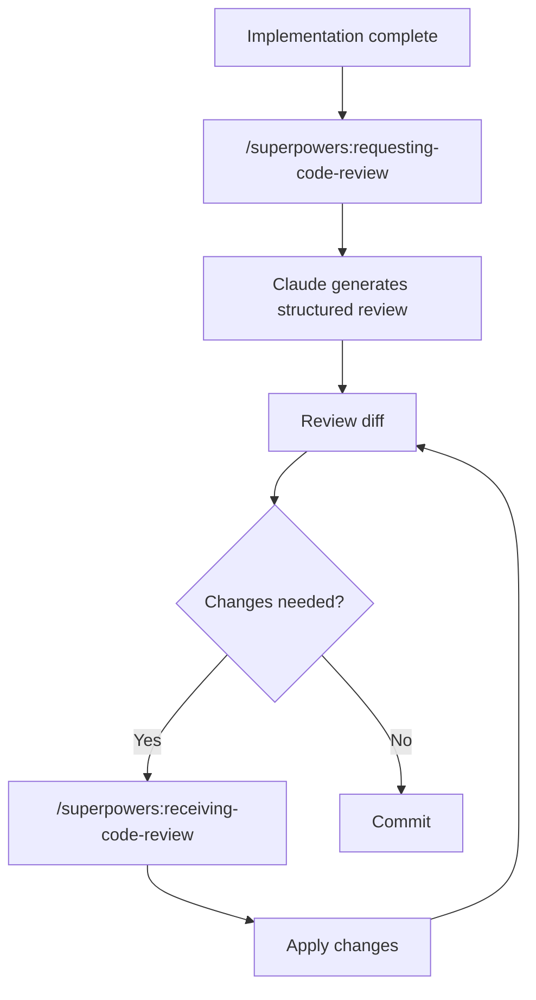
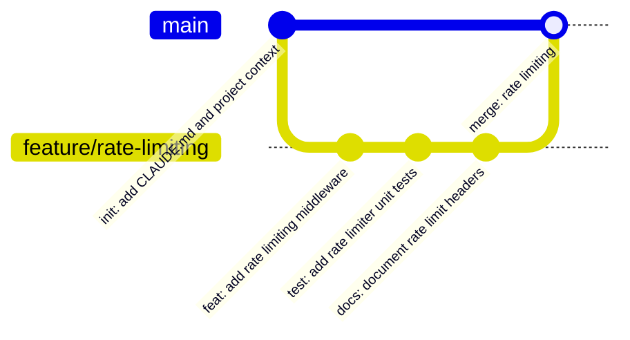

# Code Review & Git Flow

The review loop runs before any commit, and commits stay small and meaningful. Together they keep the history reviewable and double as a [cross-session continuity layer](session-continuity.md#git-history-as-memory).

- [Code Review](#code-review)
  - [Native `/code-review` and `/simplify`](#native-code-review-and-simplify)
  - [mattpocock `code-review`: the two-axis review](#mattpocock-code-review-the-two-axis-review)
  - [Which review when](#which-review-when)
- [Git Flow](#git-flow)

---

## Code Review

When a significant piece of work is complete, the review loop runs before any commit is made.



1. Run `/superpowers:requesting-code-review` — Claude reviews the implementation against the original plan and coding standards, then produces a structured report: issues found, severity, suggested fixes.

2. Review the pending diff. Claude Code surfaces changes inline in the terminal — press `y` to accept a hunk, `n` to reject, or `e` to edit it. For a full side-by-side view, pipe the diff through your preferred viewer or open it in your editor directly from the working directory.

3. If the review flagged issues, run `/superpowers:receiving-code-review` before applying the suggested changes. This skill enforces that Claude verifies its suggestions are technically sound rather than agreeing with feedback blindly.

4. If tests are part of the project, run them before marking the task complete:

```bash
npm test
# or
pytest
# or whatever the project's test command is
```

The `superpowers:verification-before-completion` skill blocks Claude from claiming work is done until verification commands have been run and their output confirmed.

> For a broader, parallelized review (multiple independent reviewers, or adversarial verification of each finding), promote the review into a [dynamic workflow](capabilities.md#dynamic-workflows).

### Native `/code-review` and `/simplify`

Claude Code ships two review skills of its own. They don't need Superpowers and work on any repo.

**`/code-review`** hunts for correctness bugs in the current diff, or in a target you name (a PR number, a branch, or a path). Where the model's review recipe covers them, it also reports reuse, simplification, and efficiency cleanups.

```bash
/code-review                    # review the current diff at the last-used effort level
/code-review high               # review at a given effort level: low | medium | high | xhigh | max
/code-review 142                # review PR #142
/code-review feature/rate-limit # review a branch
/code-review src/payments/      # review a path
/code-review 142 --comment      # post each finding as an inline comment on PR #142
/code-review --fix              # review, then apply the findings to the working tree
```

- **Effort level** trades precision for coverage. `low` / `medium` return fewer, high-confidence findings. `high` → `max` cover more ground and may include uncertain findings. With no level given, it reuses the level you typed last.
- **`--comment`** posts the findings as inline PR comments (via `gh`), so the review lands where teammates see it. Use it on a PR target.
- **`--fix`** applies the findings to the working tree after the review. The changes are uncommitted — read the diff before committing, exactly as you would for any other edit.

**`/simplify`** is the quality-only counterpart: it reviews changed code for reuse, simplification, efficiency, and altitude (is this at the right layer?) cleanups, then applies the fixes. It does **not** hunt for bugs — use `/code-review` for that.

A typical native pass before opening a PR:

```bash
/code-review high --fix   # find and fix bugs
/simplify                 # tidy what's left
npm test                  # verify
```

And on a PR that's already open:

```bash
/code-review 142 --comment
```

### mattpocock `code-review`: the two-axis review

[mattpocock/skills](setup.md#mattpocockskills) ships its own `code-review` skill with a different goal. Instead of hunting bugs, it reviews a diff against a fixed point (commit, branch, tag, or merge-base) on **two independent axes**:

1. **Standards** — does the code follow the repo's documented standards (`CODING_STANDARDS.md`, `CONTRIBUTING.md`) plus a baseline of Fowler code smells (Mysterious Name, Duplicated Code, Feature Envy, Shotgun Surgery, and so on)? Repo-documented standards override the baseline.
2. **Spec** — does the change actually do what the originating issue or spec asked? It looks for the spec in commit references, paths you give it, or `docs/`, `specs/`, `.scratch/`.

Each axis runs as its own sub-agent so one can't mask the other — a change can pass Standards and still fail Spec. Results come back under `## Standards` and `## Spec` headings, with a one-line summary of findings per axis.

It is **model-invoked**: ask for it in plain language rather than with flags.

```
Review this branch against main with the two-axis code-review — spec is issue #88.
```

The mattpocock `implement` skill also runs this review automatically before it commits.

> **Name clash:** the mattpocock skill and the built-in both answer to `code-review`. The built-in takes `--comment` / `--fix` and effort levels; the mattpocock one does not. If you install both, check the skill listing to see which one `/code-review` resolves to, and name the one you want in your prompt.

### Which review when

| Need | Use |
|------|-----|
| Catch bugs in the diff, fast | `/code-review` (built-in) |
| Fix what the review found, automatically | `/code-review --fix` |
| Put the review on the PR for the team | `/code-review <pr> --comment` |
| Clean up code quality, no bug hunt | `/simplify` |
| Check the change against the spec and repo standards | mattpocock `code-review` |
| Review against the original plan with a receive-feedback discipline | `superpowers:requesting-code-review` → `superpowers:receiving-code-review` |

---

## Git Flow

Short, meaningful commits. One logical change per commit. No "WIP" or "misc fixes."



**Branch naming:**

```
feature/<short-description>
fix/<issue-or-description>
refactor/<what-is-changing>
```

**Commit message format:**

```
<type>: <short imperative description>

<optional body — why this change, not what it does>
```

Types: `feat`, `fix`, `refactor`, `test`, `docs`, `chore`, `ci`

**Example:**

```
feat: add idempotency key validation to payment endpoint

Stripe requires idempotency keys for all POST requests to prevent
duplicate charges on retried requests.
```

Claude Code generates commit messages following this format when the `/commit` command is run. Review the suggested message before confirming.

### Atomic commits, no co-authoring

This workflow keeps commits **atomic, short, and free of any `Co-Authored-By` / "Generated with Claude Code" trailer.** The `ship-pr` skill writes commits this way by default. To make the rule stick across sessions — and to enforce it deterministically — see [Memory & Rules → Worked example](memory-and-rules.md#worked-example-atomic-commits-no-co-authoring), which shows the same rule encoded in `CLAUDE.md`, in memory, and as a git hook.
