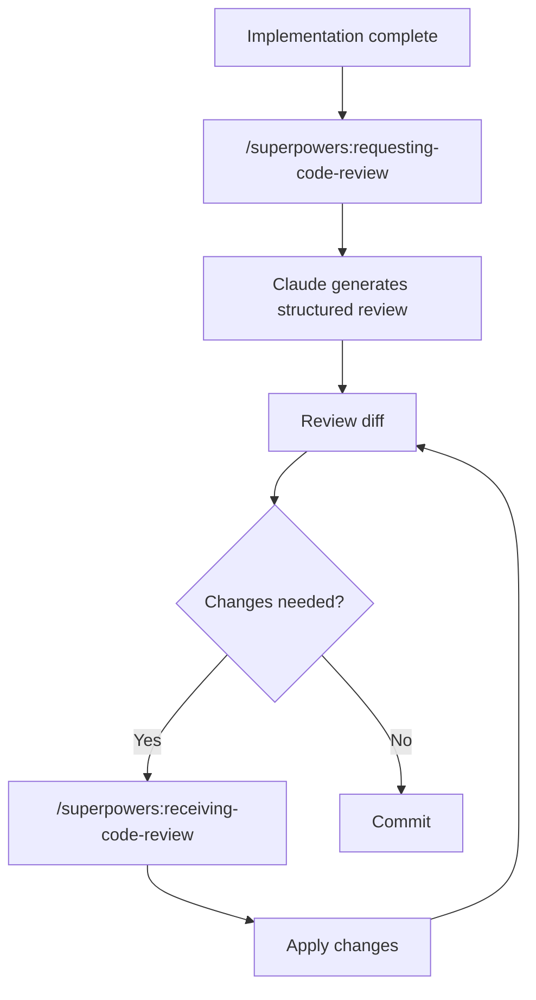
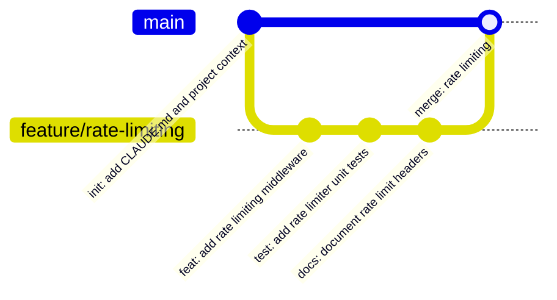

# Code Review & Git Flow

The review loop runs before any commit, and commits stay small and meaningful. Together they keep the history reviewable and double as a [cross-session continuity layer](session-continuity.md#git-history-as-memory).

- [Code Review](#code-review)
- [Git Flow](#git-flow)

---

## Code Review

When a significant piece of work is complete, the review loop runs before any commit is made.



1. Run `/superpowers:requesting-code-review` — Claude reviews the implementation against the original plan and coding standards, then produces a structured report: issues found, severity, suggested fixes.

2. Review the pending diff. Claude Code surfaces changes inline in the terminal — press `y` to accept a hunk, `n` to reject, or `e` to edit it. For a full side-by-side view, pipe the diff through your preferred viewer or open it in your editor directly from the working directory.

3. If the review flagged issues, run `/superpowers:receiving-code-review` before applying the suggested changes. This skill enforces that Claude verifies its suggestions are technically sound rather than agreeing with feedback blindly.

4. If tests are part of the project, run them before marking the task complete:

```bash
npm test
# or
pytest
# or whatever the project's test command is
```

The `superpowers:verification-before-completion` skill blocks Claude from claiming work is done until verification commands have been run and their output confirmed.

> For a broader, parallelized review (multiple independent reviewers, or adversarial verification of each finding), promote the review into a [dynamic workflow](capabilities.md#dynamic-workflows).

---

## Git Flow

Short, meaningful commits. One logical change per commit. No "WIP" or "misc fixes."



**Branch naming:**

```
feature/<short-description>
fix/<issue-or-description>
refactor/<what-is-changing>
```

**Commit message format:**

```
<type>: <short imperative description>

<optional body — why this change, not what it does>
```

Types: `feat`, `fix`, `refactor`, `test`, `docs`, `chore`, `ci`

**Example:**

```
feat: add idempotency key validation to payment endpoint

Stripe requires idempotency keys for all POST requests to prevent
duplicate charges on retried requests.
```

Claude Code generates commit messages following this format when the `/commit` command is run. Review the suggested message before confirming.

### Atomic commits, no co-authoring

This workflow keeps commits **atomic, short, and free of any `Co-Authored-By` / "Generated with Claude Code" trailer.** The `ship-pr` skill writes commits this way by default. To make the rule stick across sessions — and to enforce it deterministically — see [Memory & Rules → Worked example](memory-and-rules.md#worked-example-atomic-commits-no-co-authoring), which shows the same rule encoded in `CLAUDE.md`, in memory, and as a git hook.
