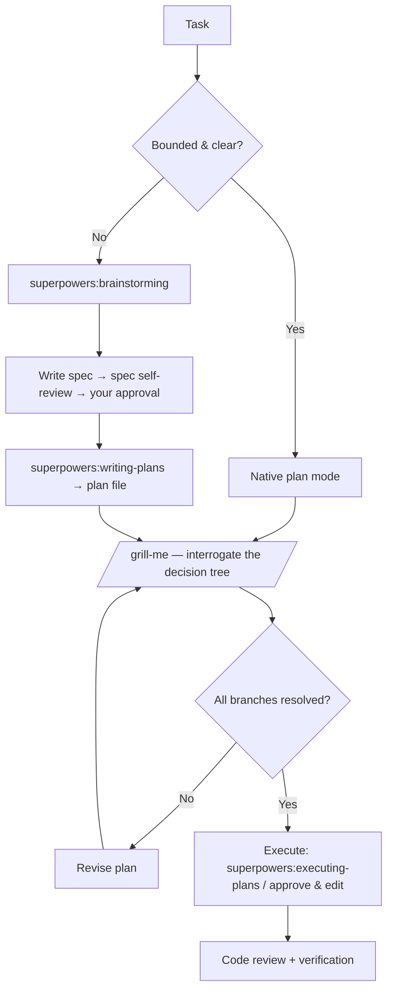

# Planning: Plan Mode vs Superpowers (and Grilling the Plan)

Both native **plan mode** and the **Superpowers planning skills** exist to stop the same failure: Claude doing a lot of work in the wrong direction before you notice. They solve it at different depths. This document compares them, says when to use which, and shows where a **grilling** step (`grill-me`) makes either one much stronger.

- [The two approaches](#the-two-approaches)
- [Native plan mode](#native-plan-mode)
- [Superpowers planning](#superpowers-planning)
- [Head-to-head](#head-to-head)
- [Which should you use?](#which-should-you-use)
- [Grilling the plan](#grilling-the-plan)
- [The recommended planning loop](#the-recommended-planning-loop)

---

## The two approaches

| | Native plan mode | Superpowers planning |
|--|------------------|----------------------|
| What it is | A built-in *mode* where Claude can't edit until you approve | A *skill pipeline*: brainstorm → write spec → write plan → execute |
| Output | An in-chat plan you approve | Durable artifacts: a spec doc and a step-by-step plan file |
| Review | One approval gate | Multiple review loops (spec self-review, your approval, plan review) |
| Where it lives | The conversation | Files on disk (`docs/superpowers/specs/`, plan files) |
| Best for | Bounded, well-understood tasks | Multi-step work, fuzzy requirements, work spanning sessions |

They are **not mutually exclusive** — plan mode is the safety rail (no edits without approval); the Superpowers skills are the *method* you run inside it.

---

## Native plan mode

Plan mode (`EnterPlanMode` / `ExitPlanMode`) flips Claude into a research-and-design state where the editing tools are withheld. Claude explores the codebase, asks clarifying questions, proposes an approach, and presents a plan. Only when you approve (`ExitPlanMode`) can it start changing files.

**Strengths**

- Zero setup — it's built in.
- Hard safety guarantee: nothing is edited before you say go.
- Fast: one plan, one approval, then execution.

**Limits**

- The plan lives in the chat. Close the session and it's gone unless you saved it.
- A single approval gate. If the plan is plausible-but-wrong, you find out during execution.
- No enforced spec/plan separation, no structured review of the *requirements* themselves.

Best when the task is bounded and you mostly need a sanity check before edits.

---

## Superpowers planning

Superpowers treats planning as a disciplined pipeline of skills, each producing a durable artifact and each gated by review:

1. **`brainstorming`** — runs *before* any creative work. Explores intent and requirements: asks clarifying questions one at a time, proposes 2–3 structural approaches with trade-offs and a recommendation, presents the design section by section for approval.
2. **`writing-plans`** — takes the approved spec and produces a concrete, step-by-step implementation plan as a file.
3. **`executing-plans`** — runs the plan in a separate session with review checkpoints, so execution context is clean and each chunk is verified.

What you actually see in the terminal during the spec phase:

```
7 tasks (1 done, 1 in progress, 5 open)
  ✔ Explore project context
  ◼ Ask clarifying questions
  ◻ Propose 2-3 structural approaches
  ◻ Present design sections and get approval
  ◻ Write design doc
  ◻ Spec self-review and user approval
  ◻ Transition to writing-plans
```

| Step | What happens |
|------|-------------|
| Explore project context | Reads relevant files, checks git history, identifies existing patterns |
| Ask clarifying questions | One at a time — no assumptions about intent |
| Propose 2–3 approaches | Each with trade-offs and a recommendation |
| Present design sections | Shown section by section; you approve each |
| Write design doc | Approved spec written to `docs/superpowers/specs/` |
| Spec self-review | Claude checks for placeholders, contradictions, ambiguity before handing off |
| Transition to writing-plans | A separate skill generates the step-by-step plan |

**Strengths**

- **Spec and plan are separate, durable files** — you can review, edit, version, and resume them across sessions.
- **Multiple review loops.** The requirements are reviewed (spec self-review + your approval) *before* a single implementation step is written. Most wrong-direction work is killed here, not in code.
- **Clean execution context.** `executing-plans` runs the plan fresh with checkpoints, so the implementation session isn't carrying the whole brainstorming transcript.

**Costs**

- More steps and more ceremony — overkill for a two-line fix.
- Produces files you have to manage.

This is the approach this workflow defaults to, precisely because the **spec → plan review loops** catch misunderstandings while they're still cheap to fix.

---

## Head-to-head

| Dimension | Plan mode | Superpowers planning |
|-----------|-----------|----------------------|
| Setup cost | None (built in) | Install Superpowers |
| Ceremony | Low | Higher |
| Requirements review | Implicit, single gate | Explicit, multiple loops |
| Artifacts | Ephemeral (chat) | Durable (spec + plan files) |
| Cross-session | Weak | Strong — pick the plan back up later |
| Catches wrong assumptions | At execution | At spec review (earlier, cheaper) |
| Edit safety | Enforced (no edits till approved) | Use *inside* plan mode for the same guarantee |
| Sweet spot | Small/bounded tasks | Multi-step, fuzzy, or long-lived work |

---

## Which should you use?

- **Small, well-understood change** (fix this bug, add this flag): native plan mode. One gate, go.
- **Anything multi-step, fuzzy, or spanning sessions**: Superpowers planning, for the spec/plan review loops and durable artifacts.
- **Either way**: stay in plan mode (no edits) until the plan is approved, and **grill the plan before executing.**

---

## Grilling the plan

A plan that *reads* coherent can still be wrong, because **no one knows exactly what they want until they're forced to defend each decision.** Both plan mode and Superpowers produce a plan; neither, by default, attacks it. That's the gap [`grill-me`](https://github.com/mattpocock/skills) (from [mattpocock/skills](setup.md#mattpocockskills)) fills.

`grill-me` runs a relentless interview: it walks the **decision tree** of your plan and interrogates each branch — every assumption, every "we'll figure it out later," every ambiguous term — until there's nothing unresolved left to ask. It surfaces the questions you didn't think to answer.

Where it slots in: **after a plan exists, before code is written.**

```
Plan mode:           explore → plan → [GRILL] → approve → execute
Superpowers:  brainstorm → spec → plan → [GRILL] → execute
```

Invoke it once you have a plan to defend:

```
/grill-me
```

Two flavors:

- **`grill-me`** — pure interrogation of the plan's decision tree.
- **`grill-with-docs`** — the same grilling, but it cross-checks your plan against the project's *existing* domain model and documented decisions (CONTEXT.md, ADRs), sharpens terminology to match, and **updates that documentation inline** as decisions are settled. Use this one when the project already has a documented domain language you must stay consistent with.

The grilling pairs naturally with the spec phase: Superpowers' spec self-review checks the plan for *internal* defects (placeholders, contradictions); grilling checks it for *external* ones (wrong assumptions about what you actually want). One looks inward, the other looks at you.

---

## The recommended planning loop

Putting it together — the default in this workflow:



1. **Choose depth** — plan mode for small, Superpowers for everything else.
2. **Produce the plan** (and, for Superpowers, a durable spec first with its review loop).
3. **Grill it** with `grill-me` / `grill-with-docs` until every decision-tree branch is resolved.
4. **Execute** with edits gated behind approval, then run [code review and verification](code-review-and-git.md).

The earlier a misunderstanding dies, the cheaper it is. Spec review kills internal defects; grilling kills wrong assumptions; both happen before a line of code exists. That's the entire point.
