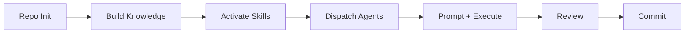
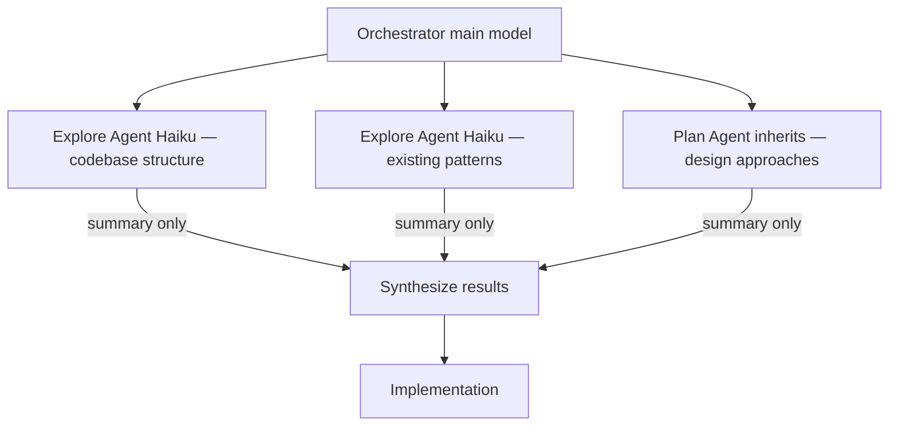
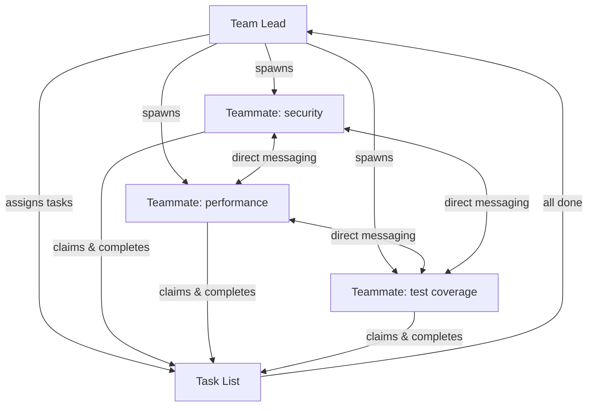

# The Workflow

Every task follows the same loop: **Research → Plan → Execute → Review → Ship.** Skills enforce it so it happens the same way every time, rather than Claude improvising. This document covers the loop itself, how a repo is set up for it, and how work is dispatched across agents.



- [Repo Init](#repo-init)
- [Building Knowledge](#building-knowledge)
- [Skills and Plan Mode](#skills-and-plan-mode)
- [Agent Dispatch](#agent-dispatch)
- [Model selection per task](#model-selection-per-task)

---

## Repo Init

Every new repository starts with `/init`. This command instructs Claude to explore the codebase — directory structure, dependencies, existing conventions — and generate a `CLAUDE.md` file at the root.

```
/init
```

`CLAUDE.md` is the project's standing instructions for Claude. It tells the agent what the project does, which patterns to follow, which files not to touch, and any project-specific constraints. Claude reads this file at the start of every session.

A minimal `CLAUDE.md` looks like this:

```markdown
# Project Context

This is a TypeScript REST API built with Express and Prisma.

## Conventions
- Use async/await, not callbacks
- All database access goes through the repository layer in src/repositories/
- Run `npm test` before committing

## Do Not Modify
- src/migrations/ — managed by the DBA team
```

`CLAUDE.md` is also where standing project rules live — see [Memory & Rules](memory-and-rules.md) for when a rule belongs here, in memory, or in a hook.

---

## Building Knowledge

For projects with internal APIs, proprietary domain models, or documentation that Claude has no training data for, a local MCP fills that gap. Instead of pasting long context into every prompt, you register a server that Claude can query on demand.

The local MCP in this repo exposes project-specific context as structured tools. Claude calls the MCP during planning and execution phases to retrieve accurate information rather than inferring from incomplete context.

Register and verify the local MCP before starting work on a new repository:

```bash
claude mcp add project-context -- node ./mcp/dist/index.js
claude mcp list
```

Full walkthrough in [Creating Your Own MCP](creating-mcp.md). The trade-off (why a tool call beats reading files) is laid out in [Setup → MCP vs codebase reading](setup.md#mcp-vs-codebase-reading).

---

## Skills and Plan Mode

Skills are the core mechanism that makes this workflow structured rather than ad-hoc. When Superpowers is installed, Claude checks at the start of every task whether a skill applies. If one does, it loads the skill's instructions and follows them before taking any other action.

The most visible example is plan mode. When a task requires implementation — writing code, creating files, making changes — Claude enters plan mode before touching anything. It explores the codebase, asks clarifying questions one at a time, proposes approaches, and presents a full plan for approval. Only after the user approves does Claude begin implementation.

This structure prevents the most common failure mode of AI-assisted development: Claude doing a lot of work in the wrong direction before the developer notices.

> Planning is a deep topic in this workflow. For the difference between native plan mode and the Superpowers planning pipeline — and where a grilling step fits — see [Planning: Plan Mode vs Superpowers](planning.md). For what a skill actually is versus a command, see [Skills vs Commands](skills-vs-commands.md).

---

## Agent Dispatch

Claude Code has three mechanisms for doing more than one thing at once. Choosing the right one determines how agents communicate, how results flow back, and what the token cost looks like. The summary table is in [Capabilities](capabilities.md#subagents-vs-agent-teams-vs-workflows); the detail is here.

### Parallel subagents

Subagents run within a single session. The orchestrator spawns them, they work in isolated context windows, and they return a summary to the main conversation when done. They cannot message each other — all coordination goes through the orchestrator.



Up to 10 subagents run simultaneously in a single session. Each operates in its own context window — exploration results and intermediate output never pollute the main conversation. The orchestrator receives only the final summary from each subagent.

The `superpowers:dispatching-parallel-agents` skill governs when subagents are dispatched. It prevents unnecessary parallelism (which wastes tokens) and enforces sequential execution when agents share state or file dependencies.

Use subagents for:

- Parallel codebase exploration before implementation
- Isolated verification tasks (type checking, linting, tests)
- Targeted research that would flood the main context

### Agent teams

Agent teams are separate, fully independent Claude Code sessions that coordinate through a shared task list and a messaging mailbox. Unlike subagents, teammates can send messages directly to each other without routing through the lead.



Agent teams are experimental and disabled by default. Enable them in `settings.json`:

```json
{
  "env": {
    "CLAUDE_CODE_EXPERIMENTAL_AGENT_TEAMS": "1"
  }
}
```

Spawn a team from a prompt to the lead:

```
Create an agent team to review PR #142. Spawn three reviewers:
- One focused on security implications
- One checking performance impact
- One validating test coverage
Have them review in parallel and report findings.
```

Teammates self-claim tasks from the shared list as they finish their current work. Task claiming uses file locking to prevent race conditions when multiple teammates try to claim the same task simultaneously. When a task that others depend on is completed, blocked tasks unblock automatically.

Start with 3–5 teammates. Beyond that, coordination overhead and token cost increase faster than throughput. Keep teammates from editing the same files — two teammates writing to the same file leads to overwrites (or give each its own [worktree](capabilities.md#worktree-isolation)).

### Dynamic workflows

When the job is large, parallel, and benefits from built-in verification — codebase-wide audits, big migrations, exhaustive research — promote the plan into a [dynamic workflow](capabilities.md#dynamic-workflows): a script that orchestrates tens to hundreds of subagents with deterministic control flow and adversarial cross-checking. That's the heaviest tool; reach for it only when the scale justifies the token cost.

---

## Model selection per task

Claude Code routes each subagent or teammate to a model based on the nature of the task. The model is resolved in this order:

1. The `CLAUDE_CODE_SUBAGENT_MODEL` environment variable — set in `~/.claude/settings.json` under `env` for a persistent global default, or exported in the shell for a session-scoped override
2. The per-invocation `model` parameter passed by the orchestrator
3. The `model` field in the subagent's definition file
4. The main conversation's model (`inherit`, the default)

Built-in subagents follow this allocation:

| Subagent | Model | Reason |
|----------|-------|--------|
| Explore | Haiku | Read-only file search — low latency, high throughput |
| Plan | Inherits | Research during plan mode — needs orchestrator-level reasoning |
| General-purpose | Inherits | Multi-step tasks requiring exploration and modification |
| Claude Code Guide | Haiku | Feature questions — simple lookups |
| statusline-setup | Sonnet | Lightweight configuration with reliable instruction following |

**File reads and directory listings run on Haiku.** The Explore agent handles these with read-only tools and minimal context. **MCP tool calls are inherited by all subagents** by default — you can scope a specific MCP to a single subagent to keep its tool descriptions out of the main context window entirely.

See [Creating Agents by Repo](creating-agents.md) for how to set a custom subagent's model, `effort`, and worktree isolation in its definition file. The current model lineup is in [Capabilities → The model lineup](capabilities.md#the-model-lineup).
